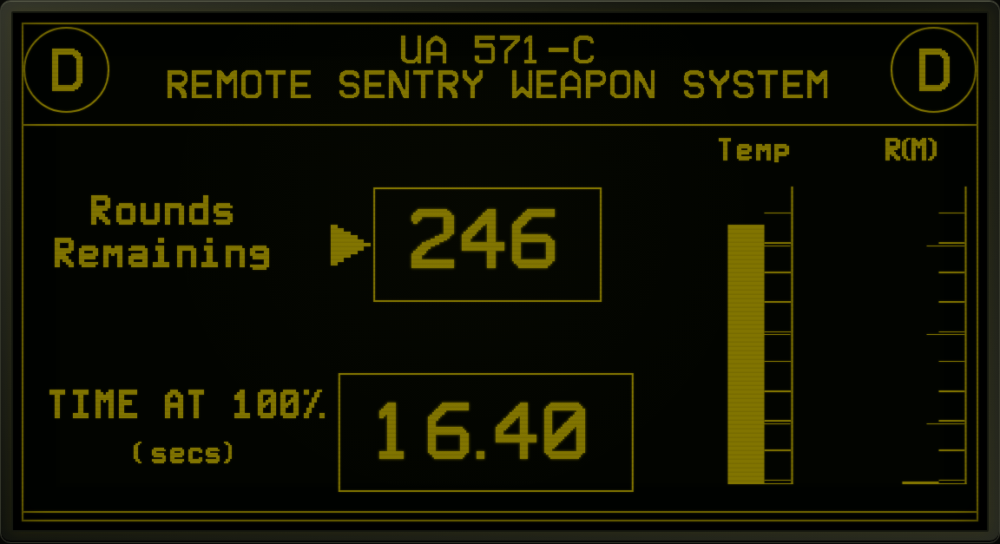

# UA571C.com

[](https://github.com/banastas/UA571C.com/actions/workflows/ci.yml)
[](#verification)
[](#local-development)

A keyboard-controlled working-prop study of the UA 571-C remote sentry terminal from <a href="https://onesheet.org/movie/aliens-1986/">*Aliens*</a>.



UA571C.com is a product site that stays inside the product. There is no conventional landing page, navigation, feature grid, or gallery. The visitor boots directly into the fictional remote terminal, configures the system, runs its test routine, arms it, and watches 500 rounds disappear.

The interface is rebuilt in HTML, CSS, and JavaScript from visual references. No film stills, video, audio, frameworks, or third-party runtime services are shipped with the site. The terminal self-hosts browser conversions of the original 1984 GRiD bitmap font binaries preserved by [Thom Cherryhomes](https://github.com/tschak909), whose [UA571C reconstruction](https://github.com/tschak909/UA571C) includes the recovered GRiD development environment and source.

The recovered Pascal source maps TypeBlock 12×16 to the header and numeric readouts, TypeBlock 24×32 to the unit roundels, TypeBlock 9×12 to fields and telemetry labels, and TypeGRiD 5×8 to system text. In the responsive browser version, the header and counters use the original 24×32 companion face as well: it preserves the same GRiD construction at display sizes where the packed 12×16 strokes become ambiguous. The original `.TYP` objects, mechanical WOFF2 conversions, attribution, and reproducible converter are all included in [`assets/fonts`](assets/fonts/README.md).

The current telemetry layout follows the clearest full-screen film reference, including its `D` roundels. `UA 571-C` is the weapon model; the roundel letter identifies the active sentry unit.

The boot sequence completes automatically. Press `Escape`, activate the skip
button, or click anywhere on the boot screen to enter the terminal immediately.

Generated font assets use content-hashed filenames because Cloudflare serves
them with a long immutable cache lifetime. Regenerating a font therefore also
requires updating its filename and the matching `@font-face` URL.

## Controls

| Key | Action |
| --- | --- |
| `1` through `7` | Cycle the corresponding selector |
| `Space` | Arm and hold to fire |
| `E` | Arm and toggle automatic engagement |
| `T` | Run the selected test routine |
| `R` | Reload and cool the system |
| `M` | Toggle synthesized terminal sound |
| `F` | Toggle fullscreen |
| `V` | Switch between configuration and live telemetry |
| `?` | Show the command overlay |
| `Esc` | Cease fire or close the current overlay |

Every selector and command is also clickable or tappable. Audio is synthesized locally with the Web Audio API and begins only after user input.

Phones and tablets operate in landscape. Installed/fullscreen mode requests a landscape display, while portrait browser sessions show a focused device-rotation interlock and safely cease any active or automatic fire until the device returns to landscape. The interlock follows the visual viewport during rotation so transient iOS Safari orientation-query lag cannot obscure the landscape terminal.

## Local development

The site is intentionally build-free and has no runtime dependencies. Starting it locally requires only Python; the optional browser test suite uses Playwright.

```sh
npm start
```

Open <http://localhost:4173>.

## Verification

```sh
npm run check
```

For the desktop and mobile browser suite:

```sh
npm install
npx playwright install chromium
npm run test:browser
```

The automated suite covers:

- Reference-screen defaults and the 500-round initial state
- Selector cycling, wrapping, and invalid input
- Safe and armed firing gates
- Ammunition depletion and automatic cutoff
- Thermal cutoff, cooling, cease fire, and reload
- Film-matched 15-round-per-second countdown and 50-round critical threshold
- Unique DOM identifiers and application hooks
- Module loading, canonical metadata, and accessibility affordances
- Required deployment files
- Original GRiD object metrics, one-based strike decoding, and the `81H` pointer glyph
- TypeBlock 9×12 and 12×16 low-bit cell alignment for clean labels and headers
- TypeBlock 24×32 display-order packing for legible unit roundels
- Readable original GRiD face assignments across boot, configuration, telemetry, and command-overlay states
- Optical decimal spacing for the fixed-cell TypeBlock countdown at initial, active, and critical values
- Landscape-only phone and tablet operation with portrait interlock and safe firing suspension
- Portrait rotation guidance with reserved animation clearance from the surrounding copy
- Shallow iOS-style landscape viewports without a stale portrait interlock or horizontal overflow
- Container-relative configuration and live telemetry at wide, shallow Safari viewport proportions

The interface has also been exercised in desktop and mobile browsers for boot, keyboard arming, view switching, firing, reload, the test routine, the alternating critical warning, the command dialog, touch input, responsive bounds, and console errors.

## Deployment

The repository root is the deployable static artifact. No build command is required.

- **Publish directory:** `/`
- **Build command:** none
- **Canonical domain:** `https://ua571c.com/`
- **Fallback:** `404.html`

`CNAME` supports GitHub Pages. `_headers` provides compatible security headers on Cloudflare Pages and Netlify. `.nojekyll` prevents GitHub Pages from applying Jekyll processing.

DNS and hosting configuration remain external to this repository.

## Project structure

```text
index.html              Terminal markup and site metadata
styles.css              Responsive terminal, CRT, and interaction styling
assets/fonts/           Original GRiD font objects and browser conversions
src/app.mjs             DOM, keyboard, touch, audio, and animation behavior
src/state.mjs           Pure terminal state machine
tests/state.test.mjs    Node test suite
tests/browser.spec.mjs  Desktop and mobile interaction suite
scripts/validate.mjs    Structural and deployment validation
scripts/build-fonts.py  Reproducible GRiD .TYP to WOFF2 converter
playwright.config.mjs   Local and CI browser-test configuration
docs/CONCEPT.md         Product and experience rationale
```

## Design boundaries

- The interface itself is the product demonstration and the entire product site.
- The crude grid, yellow phosphor, hard selection bars, and finite ammunition state are the identity.
- Explanatory material stays outside the live terminal so the working-prop illusion survives.
- The project is a fan-made interface study, not an official product or a simulation of a real weapon system.
- Motion preferences are respected, and every interaction has a keyboard and pointer path.

See [the concept note](docs/CONCEPT.md) for the complete rationale.

## Acknowledgment

Inspired by the fictional UA 571-C remote sentry terminal seen in *Aliens* (1986). *Aliens* and associated names and designs belong to their respective rights holders. This non-commercial fan project is presented as an interface study and tribute.
